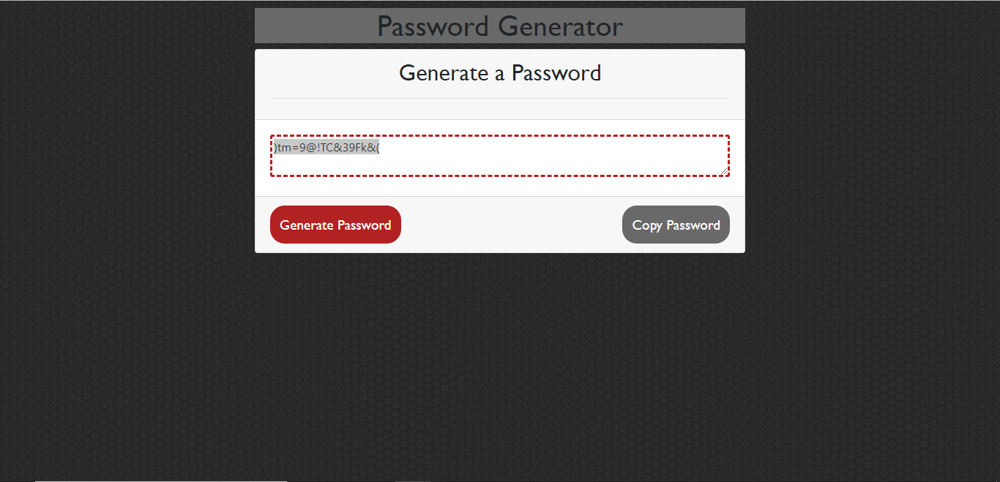

# Password_Generator_HW

# First Steps

With this assignment, the prework helped to set up the html page, so a majority of the work had to be done to the script.js file. Initally there were some issues getting started regarding how to randomnly generate a number of characters in a randomize order. I had first created a varible that listed every single character that was going to be used inside the password generator, but the results were not well.

It was hard to figure out how to generate the password through the button and the following steps had to focus on selecting these characters. After taking some time to think about things, I ended up redoing the script.js file in favor of a way that was discussed earlier in class.

Using that form of javascript, I started to create a script.js that would work with creating random characters. I created four different options, each detailing every character for Upper and Lower case, Numbers and Special Characters. After this, I added some conditionals that would allow the user to pick any one or all four of the prompts, however they do have to make a selection before the password can be generated.

Once this was tested and proved that it work, there was a new issue that came across. The user generated password did appear; however, the password would be displayed on an alert prompt instead of the textarea box on the html file.

I wasn't sure how to fix this issue and tried a different number of fixes in order to display the password properly. What I did was created a function for the password and inside the function, I added document.getElementById("password").vaule = text. Once I created this and linked the function in the proper place, I tested the generator again and the text displated in the textarea.

The final step was to get the copy password button to work. After I worked out how to get the password into the textarea, I figured out how to get the script working for copy password. Inside the copyPassword function, I added document.getElementById("password").select(), followed by document.execCommand("Copy").

A few quick tests later, and everything on the page seemed to be working properly. All that was left was to work on the style.css to get the page looking proper as well as function properly as well.

